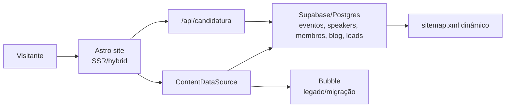

# Masterboard Site

Site institucional da Masterboard, construído em Astro para entregar uma presença pública rápida, indexável e conectada à base operacional da empresa.

## Beliefs

O site precisa continuar leve e forte em SEO, mas sem virar a fonte de verdade dos dados. Eventos, speakers, membros, empresas, blog e candidaturas devem ser servidos por uma camada de dados centralizada para permitir evolução para app, painel interno, CRM e automações.

Hoje o projeto já separa a interface pública da origem dos dados por meio do contrato `ContentDataSource`, o que permite trocar ou evoluir adapters sem reescrever páginas.

## Desires

- Publicar páginas institucionais, eventos, blog e sitemap com boa performance.
- Manter Supabase/Postgres como base operacional principal.
- Preservar Bubble como origem legada ou apoio temporário durante migração.
- Receber candidaturas pelo site e gravar leads estruturados para operação comercial.
- Preparar o caminho para painel interno, app de membros, analytics e automações.

## Intentions

O fluxo arquitetural recomendado para esta fase é:



## Arquitetura Atual

- `site/`: aplicação Astro, componentes, páginas, estilos, scripts e assets públicos.
- `site/src/lib/data-source.ts`: contrato de dados consumido pelas páginas.
- `site/src/lib/adapters/supabase/`: adapter ativo para Supabase/Postgres.
- `site/src/lib/adapters/bubble/`: adapter legado para leitura/migração de dados do Bubble.
- `site/src/pages/api/candidatura.ts`: endpoint server-side para candidaturas.
- `site/src/pages/sitemap.xml.ts`: sitemap dinâmico com páginas, eventos e posts.
- `site/docs/`: documentação de deploy, modelo de dados e arquitetura ideal.
- `CHANGELOG.md`: histórico das mudanças feitas no projeto.

## Stack

- Framework: Astro 4 com `output: 'hybrid'`.
- Deploy alvo: Vercel Serverless via `@astrojs/vercel`.
- UI/CSS: Astro components + Tailwind CSS.
- Dados: Supabase/Postgres com `@supabase/supabase-js`.
- Origem legada: Bubble API.
- SEO: páginas estáticas/híbridas, metadados por rota e sitemap dinâmico.
- Testes/scripts: testes Node para importadores, payload de candidatura e parser de speakers.

## Variáveis de Ambiente

As variáveis abaixo são esperadas no ambiente de produção quando os recursos correspondentes estiverem ativos:

```bash
SUPABASE_URL=
SUPABASE_ANON_KEY=
SUPABASE_SERVICE_ROLE_KEY=
ADMIN_EMAILS=admin@masterboard.com.br
BUBBLE_BASE_URL=https://app.masterboard.com.br/api/1.1
BUBBLE_API_TOKEN=
LEAD_WEBHOOK_URL=
SITE_URL=https://masterboard.com.br
```

Não versionar `.env`, tokens, dumps de banco ou credenciais.

## Desenvolvimento

```bash
cd site
npm install
npm run dev
```

## Validação

```bash
cd site
npm run test:candidatura
npm run test:speakers
npm run test:blog-import
npm run test:admin
npm run check
npm run build
```

## Painel Admin

O painel em `/admin/` usa Supabase Auth para login e `admin_users` para permissões (`admin` ou `editor`). Durante bootstrap, `ADMIN_EMAILS` funciona como allowlist de administradores até a tabela `admin_users` estar populada.

Antes de liberar o painel, aplique `site/scripts/admin-self-service-migration.sql` no Supabase. Depois crie o usuário no Supabase Auth e vincule seu `auth_user_id` em `admin_users`.

O fluxo inicial permite:

- Gerenciar posts em `content_posts` com rascunho/publicado e preview protegido.
- Ver leads em `/admin/leads/` sem token na URL.
- Editar tokens visuais e textos da hero via `site_settings`.
- Registrar ações em `admin_audit_log` para reversão e rastreabilidade.

## Próximos Passos

- Aplicar no Supabase `site/scripts/admin-self-service-migration.sql`.
- Criar usuários no Supabase Auth e vincular seus `auth_user_id` em `admin_users`.
- Confirmar no Supabase as políticas de RLS para `events`, `speakers`, `members`, `companies`, `content_posts`, `leads`, `lead_activities` e tabelas de admin.
- Fechar a migração Bubble -> Supabase para eventos, speakers, membros e empresas, mantendo rastreabilidade por `source` e `source_id`.
- Evoluir `/admin/leads` com alteração de status, filtros salvos e histórico de contato.
- Automatizar importações e revisões de dados com jobs ou scripts agendados.
- Validar preview/produção na Vercel com variáveis completas, domínio `masterboard.com.br`, HTTPS e sitemap publicado.
- Definir a fronteira entre site institucional, futuro app de membros e painel operacional.

## O Que Não Vai Para o GitHub

- `site/node_modules/`
- `site/dist/`
- `site/.astro/`
- arquivos `.env`
- backups, exports e bancos `.sql`
- credenciais
