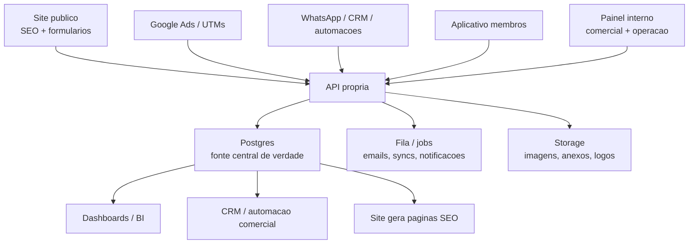
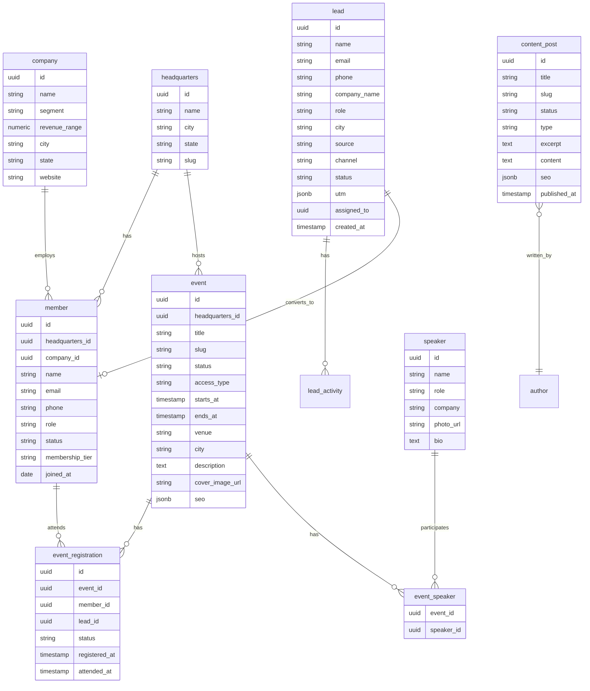
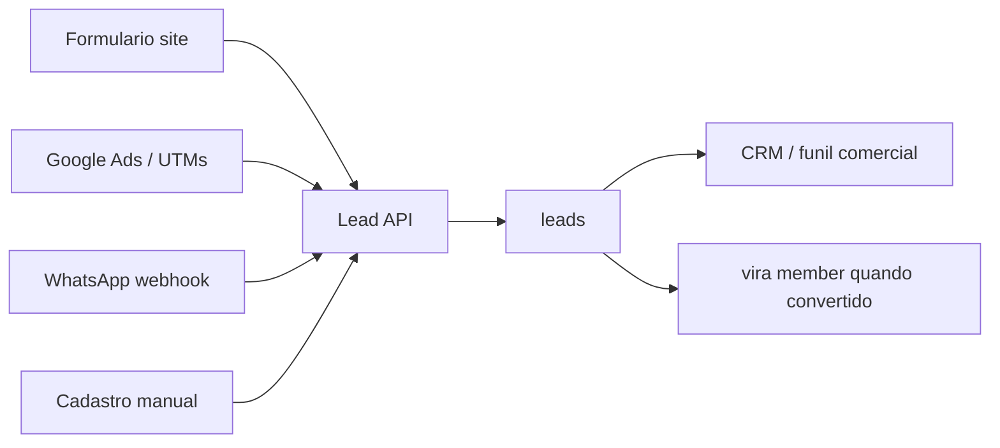
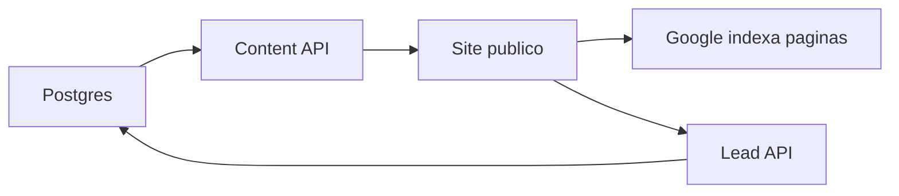
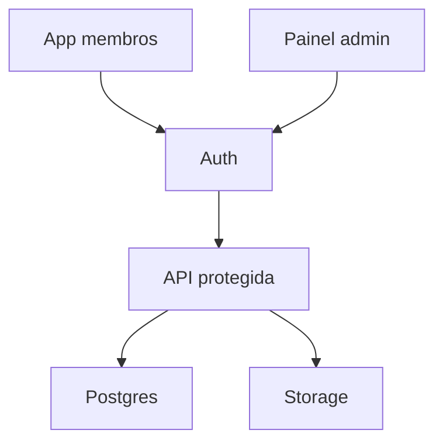

# Arquitetura Ideal de Dados da Masterboard

## Beliefs

A Masterboard precisa deixar de operar com dados espalhados em ilhas: Bubble, WordPress, formulários, WhatsApp, planilhas e ferramentas soltas. O cenário ideal é ter uma fonte central de verdade para dados comerciais, membros, eventos, conteúdo, site e aplicativo.

Hoje o Bubble pode continuar como fonte temporária, mas a arquitetura futura deve permitir trocar essa origem por uma base própria sem reescrever o site inteiro.

## Desires

Queremos uma arquitetura que suporte:

- Leads vindos do site, Google, WhatsApp, eventos, indicações e importações manuais.
- Gestão de membros por sede.
- Eventos públicos, privados, para membros e por convite.
- Site institucional rápido, indexável e forte em SEO.
- Aplicativo futuro para membros e operação.
- Painel interno para equipe comercial e operação.
- Base preparada para analytics, CRM, automações e BI.

## Intentions

A direção recomendada é uma base central em Postgres, acessada por uma API própria, com o site, aplicativo e painel consumindo a mesma fonte de dados.



## Banco Central

A recomendação principal é usar Postgres como base central. Na prática, Supabase Postgres é uma boa primeira escolha porque entrega banco, autenticação, storage, APIs, políticas de acesso e painel inicial.

Entidades principais:



## 1. Leads

Todos os canais devem alimentar a mesma tabela `leads`.

Canais previstos:

- Site.
- Google Ads.
- WhatsApp.
- Evento.
- Indicação.
- Landing page.
- Importação manual.

Campos importantes:

- `source`: origem geral, como `site`, `google_ads`, `whatsapp`.
- `channel`: canal específico, como `form_home`, `cta_evento`, `wa_business`.
- `utm_source`, `utm_medium`, `utm_campaign`, `utm_content`, `utm_term`.
- `status`: `new`, `qualified`, `contacted`, `invited`, `converted`, `lost`.
- `assigned_to`: vendedor ou responsável.
- `headquarters_id`: sede relacionada.
- `notes` ou uma tabela separada `lead_activity`.

Fluxo recomendado:



## 2. Membros Por Sede

Membro não deve ser tratado apenas como usuário. Ele pertence a uma sede, empresa, plano/tier e situação.

Tabelas recomendadas:

- `members`.
- `headquarters`.
- `companies`.
- `member_roles` ou campo `role`.
- `membership_history`, se for necessário auditar mudanças de plano, sede ou status.

Perguntas que essa estrutura deve responder:

- Quantos membros Curitiba tem?
- Quais segmentos existem por sede?
- Quais membros estão ativos, inativos ou em onboarding?
- Quais empresas estão no board?
- Quem participou de quais eventos?

## 3. Eventos

Evento precisa atender tanto a operação quanto SEO.

Campos recomendados:

- `title`.
- `slug`.
- `description`.
- `starts_at`.
- `ends_at`.
- `headquarters_id`.
- `city`.
- `venue`.
- `access_type`: `public`, `members_only`, `invite_only`.
- `status`: `draft`, `published`, `past`, `cancelled`.
- `cover_image_url`.
- `seo_title`.
- `seo_description`.
- `schema_enabled`.
- Relação com speakers.
- Relação com inscrições e presenças.

O site usa esses dados para gerar páginas indexáveis. O aplicativo usa os mesmos dados para operação.

## 4. Site

O site não deve ser o banco. Ele deve consumir dados da API ou de uma camada server-side.

Arquitetura recomendada:

- Astro ou Next para o site público.
- Páginas estáticas, SSR ou híbridas para SEO.
- Eventos e posts vindos do banco/API.
- Formulários enviando leads para a API.
- Nenhum acesso direto ao banco pelo navegador.

Fluxo recomendado:



Para velocidade e SEO:

- Eventos e posts podem ser gerados estaticamente.
- Rebuild por webhook quando conteúdo mudar.
- Fallback SSR para dados recentes, se necessário.
- Sitemap dinâmico com eventos, blog e páginas institucionais.
- Schema.org para `Organization`, `WebSite`, `FAQPage`, `Event` e `Person`.

## 5. Aplicativo

O aplicativo deve consumir a mesma API e banco do site, mas com permissões específicas.

Arquitetura recomendada:

- App separado do site institucional.
- Autenticação própria.
- API protegida por regras de acesso.
- Membros veem eventos, benefícios, comunidade e materiais.
- Comercial/admin gerencia leads, membros, eventos e presenças.



## Stack Recomendada

Uma configuração simples e forte:

- Banco: Supabase Postgres.
- Auth: Supabase Auth ou Clerk.
- Storage: Supabase Storage ou Cloudflare R2.
- Site: Astro, se o foco for institucional, SEO e performance.
- App: Next.js, se for dashboard/app complexo.
- Admin: Directus, Supabase Studio custom, Retool interno ou painel próprio.
- Automação: n8n ou Make para WhatsApp, CRM e e-mails.
- Deploy: Vercel para site/app, ou Render/Fly se precisar backend contínuo.

## Estado Atual vs Cenário Ideal

Estado atual do novo site:

```text
Astro SSR + Bubble como backend temporario + adapter isolado + paginas SEO reais
```

Cenário ideal:

```text
Astro/Next + Postgres/Supabase + API propria + painel comercial + app separado
```

## Conclusão

O ideal é uma base Postgres central com API própria, onde site, app, painel comercial, WhatsApp e Google alimentam e leem a mesma verdade, cada um com permissões e interfaces diferentes.

O site institucional precisa ser rápido e independente do app. O app precisa ser operacional. O banco central precisa ser a fonte de verdade.
